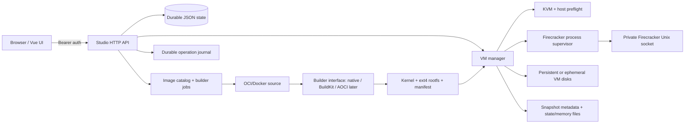

# Firecracker Studio target architecture

## Executive decision

Firecracker Studio will remain a **single-host, beginner-first control plane**. It will use the official Firecracker REST API over a private Unix socket, while the Studio API handles authentication, persistence, lifecycle reconciliation, storage ownership, and a Vue UI. It will not claim to be a managed Fargate/Lambda service, a Kubernetes replacement, or a Fly.io regional platform.

The implementation boundary is intentionally: **Docker/OCI input -> verified conversion/build step -> kernel + ext4 rootfs artifacts -> Firecracker microVM**. A Docker image is never passed directly as a Firecracker drive. The future BuildKit/AOCI integration will implement the existing builder interface rather than changing the VM manager.

## Product comparison

| Capability | Firecracker Studio target | Fargate | Lambda MicroVM images | Kubernetes | Fly Machines |
|---|---|---|---|---|---|
| Primary scope | One server, local control plane | Managed container capacity | Managed function execution and snapshot-based startup | Cluster orchestration and controllers | Managed VM lifecycle, placement, and networking |
| Operator manages host/KVM | Yes | No | No | Usually node operations are abstracted by platform | No |
| Input | VM artifact or OCI/Docker source via conversion | Container task definition/image | Container/Dockerfile build flow | Container image in a Pod | Image/config via API or flyctl |
| Isolation | Firecracker microVM per workload | Managed task boundary | Firecracker microVM managed by AWS | Pods share node kernel unless configured otherwise | Managed VM |
| Snapshot lifecycle | Explicit pause, snapshot, restore, metadata, backup/delete | Platform-managed | Platform-managed snapshot during image build | Not a native Firecracker snapshot workflow | Platform-managed suspend/resume features |
| Scheduling/autoscaling | Not in v1 | Yes | Yes | Yes | Yes/placement and regional fleet |
| Multi-host/failover | Not in v1 | Yes | Yes | Yes | Yes |

Fargate’s value is managed capacity and cluster abstraction, not a local API wrapper [3]. Lambda’s Firecracker snapshots include initialized application state and require uniqueness/network-reset considerations [4]. Kubernetes supplies Pods, controllers, scheduling, and reconciliation across nodes [5]. Fly Machines expose a simple lifecycle API but add provider-managed placement and regional infrastructure [6]. Those features are future platform layers, not prerequisites for a good single-server Studio.

## Architecture

The server must own process reconciliation. On startup it loads durable records, detects stale processes and sockets, marks interrupted operations as failed or recoverable, and never assumes that a prior `running` record means a live VM. Each VM has a host directory containing a metadata file, a socket path, a pid file, persistent disks, ephemeral disks, logs, and snapshot references.

## Lifecycle contract

The beginner path is: preflight host -> choose an image or convert one -> create VM -> start -> observe health/logs -> pause or stop -> snapshot or restore -> delete. Start must fail early with actionable KVM, Firecracker, kernel, rootfs, permissions, and networking errors. Delete must require a stopped VM unless an explicit force flag is used, and must never delete a persistent disk implicitly.

The Firecracker client will cover the supported control-plane calls relevant to this product: boot-source, drives, machine-config, network interfaces where configured, vsock where configured, metadata/MMDS where configured, actions, VM state, snapshot create, snapshot load, and metrics/log configuration. Unsupported Firecracker APIs remain explicit rather than silently fabricated.

## Persistence model

The local JSON state file is the control-plane index, not the VM data plane. Writes will be atomic (`temp file -> fsync -> rename`) and serialized. Persistent volumes are independent files or directories referenced by VM metadata and survive VM deletion only when the user chooses to retain them. Ephemeral disks are deleted with the VM. Snapshot files are owned by the snapshot catalog and require checksum, size, Firecracker version, architecture, VM configuration, disk references, and restore compatibility metadata.

## Security and long-running operation

The raw Firecracker socket remains private to the supervisor. The HTTP API binds to loopback by default; non-loopback binding requires a bearer token, and production deployment should add TLS/reverse proxy protection. Paths supplied by clients must be confined to Studio-managed roots. Resource limits, process kill/reap behavior, timeouts, structured logs, health/readiness, and startup reconciliation are required for a server that runs for weeks or months.

## Delivery slices

1. Add explicit KVM capability probing and readiness details.
2. Add durable state and operation journal with atomic writes and restart recovery.
3. Add Firecracker VM-state pause/resume and richer client endpoints.
4. Add supervisor reconciliation, persistent/ephemeral volume ownership, snapshot metadata, and safe deletion.
5. Add builder interface documentation and a safe Docker/OCI conversion adapter boundary; do not introduce BuildKit as a hard runtime dependency yet.
6. Update Vue UI for readiness, lifecycle controls, snapshots, storage mode, operations, and honest error states.
7. Run unit tests, race tests where practical, formatting, static analysis, frontend build, and archive packaging. Real boot remains hardware-dependent and must be labeled as such.

## Definition of done

| Gate | Status target |
|---|---|
| KVM preflight is visible and blocks unsafe start | Required |
| Firecracker socket is private and authenticated API is enforced | Required |
| VM state survives process restart | Required |
| Persistent and ephemeral storage semantics are explicit | Required |
| Pause/resume, snapshot create/load, start/stop/delete are exposed | Required |
| Docker/OCI is converted to bootable artifacts, never treated as a raw VM image | Required |
| UI exposes the main lifecycle without raw socket knowledge | Required |
| Tests and build evidence are recorded | Required |
| Real KVM boot test on an actual Linux host | Incomplete until run on user hardware |
| Multi-host scheduling, billing, regions, autoscaling, managed upgrades | Explicitly out of scope for v1 |

## References

[3]: https://docs.aws.amazon.com/AmazonECS/latest/developerguide/AWS_Fargate.html "AWS Fargate documentation"
[4]: https://docs.aws.amazon.com/lambda/latest/dg/microvms-images-snapshots.html "AWS Lambda MicroVM snapshots"
[5]: https://kubernetes.io/docs/concepts/workloads/pods/ "Kubernetes Pods documentation"
[6]: https://fly.io/docs/machines/ "Fly Machines documentation"
